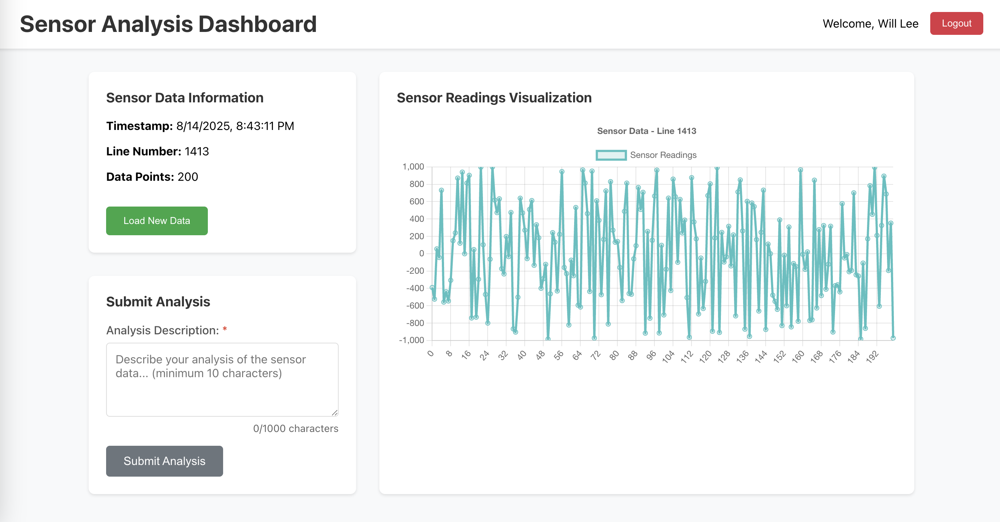
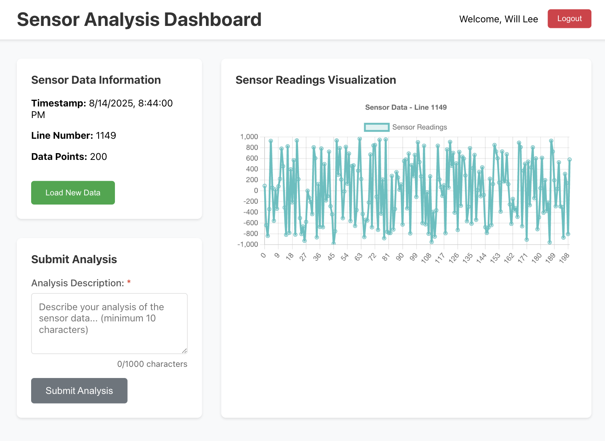
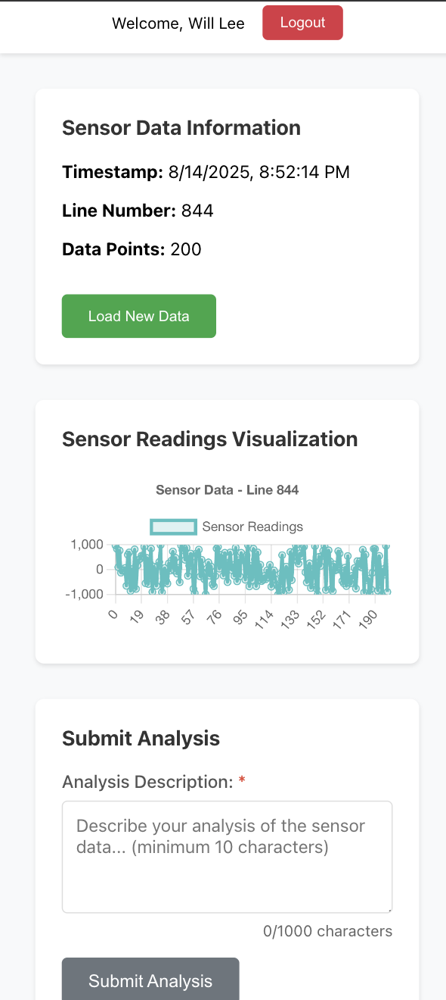

# Sensor Data Analysis Application

A dockerized React/TypeScript application for sensor data analysis with JWT authentication, connecting to the designated server.

## Features

- **Authentication**: Login/register with email, first name, and last name
- **Data Visualization**: Interactive charts displaying sensor readings (-1000 to 1000 range)
- **Analysis Submission**: Submit analysis results with plot images and descriptions
- **JWT Security**: Secure API communication with token-based authentication
- **Responsive Design**: Mobile-friendly interface
- **Docker Support**: Fully containerized application
- **Configurable ports and apis**: Pass in port and api url as env parameters

## API Endpoints (REACT_APP_API_URL)

### POST http://{REACT_APP_API_URL}/login
Register and login with user credentials.
**Request:**
```json
{
  "email": "user@example.com",
  "firstName": "John",
  "lastName": "Doe"
}
```
**Response:**
```json
{
  "token": "jwt_token_here",
}
```

### GET http://{REACT_APP_API_URL}/points
Get sensor data (requires JWT token).
**Response:**
```json
{
  "points": [-456, 789, -123, ...],
  "timestamp": "2024-01-15T10:30:00.000Z",
  "lineNumber": 3
}
```

### POST http://{REACT_APP_API_URL}/results
Submit analysis results (requires JWT token).
**Request:**
```json
{
  "plot": "base64_encoded_png_image_128x128",
  "description": "Analysis description",
  "firstName": "John",
  "lastName": "Doe",
  "email": "user@example.com",
  "lineNumber": 3
}
```

## Quick Start -  [See Note](#note)

### Using Docker Compose (Recommended)

1. **Clone and start the application (default port and api):**
```bash
git clone <repository>
cp .env.example .env
cd DataAnalysis
docker-compose up --build
```

2. **Clone and start the application (customized port and api):**
```bash
git clone <repository>
cp .env.example .env
cd DataAnalysis/scripts
./run.sh 3001 {REACT_APP_API_URL}
```

3. **Access the application:**
- Frontend: http://localhost:3001
- API Server: http://{REACT_APP_API_URL}

### Direct API Connection

The application is configured to connect directly to the {REACT_APP_API_URL} server:
- **Server**: http://{REACT_APP_API_URL}
- **CORS**: Handled by nginx proxy in Docker setup
- **Authentication**: JWT tokens provided by {REACT_APP_API_URL} server


## Project Structure

```
src/
├── components/           # React components
│   ├── Dashboard.tsx    # Main dashboard with charts
│   ├── Login.tsx        # Authentication form
│   └── ProtectedRoute.tsx # Route protection
├── context/             # React context
│   └── AuthContext.tsx  # Authentication state
├── services/            # API services
│   └── api.ts          # HTTP client and API calls
├── types/              # TypeScript definitions
│   └── index.ts        # Type definitions
├── App.tsx             # Main application component
└── index.tsx           # Application entry point
```

## Note

Restore the actual {REACT_APP_API_URL} in the following files before run the app
```
.env
.env.sample
docker-compose.yaml
nginx.conf
scripts/run.sh
src/services/api.ts
```

Placeholders are used to shield the actual url.


## Screenshots

### Desktop


### Tablet


### Mobile

